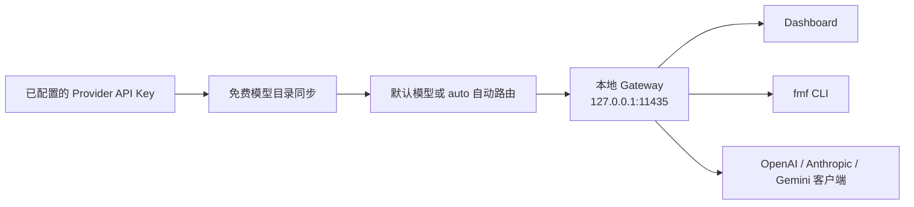

# FreeModelFinder 使用指南

FreeModelFinder 将多个第三方平台的**可用免费文本模型**统一为一个本地服务：你只需要配置一次各平台的 API Key，就可以在 Dashboard、终端、macOS 状态栏应用和现有 AI 客户端中使用同一组模型。把模型写成 `auto` 时，系统还可以在遇到限流后切换到另一条可用的免费来源。

> “免费”不等于无限量、永久免费或可用于生产。项目只收录符合各 Provider 免费规则的文本模型；账号地区、实名认证、绑定计费项目、试用额度和上游政策都可能改变实际可用性与账单。请始终以 Provider 控制台和服务条款为准。

## 1. 它能做什么

| 能力         | 说明                                                                                                                                  |
| ------------ | ------------------------------------------------------------------------------------------------------------------------------------- |
| 聚合模型目录 | 汇集 10 个内置 Provider 的免费文本模型，并支持多个自定义 OpenAI-compatible 来源。目录刷新失败时保留上一轮成功结果，同时显示失败原因。 |
| 一个本地入口 | 默认在 `127.0.0.1:11435` 提供 OpenAI、Anthropic 和 Gemini 兼容接口，已有客户端通常只需改 Base URL 和模型名。                          |
| 自动接力     | 在启用自动路由后，识别 429、quota、RPM 等限流信号，记录冷却时间并选择下一条可用来源。                                                 |
| 可视化管理   | Dashboard 可添加/移除 Provider、搜索筛选模型、查看上下文窗口与本地配额观测、发起连通性探测和流式对话测试。                            |
| 多种使用方式 | 提供 npm CLI、浏览器 Dashboard 和 macOS 纯状态栏应用；三者共享同一份本机配置。                                                        |
| 本机保护     | Provider Key、Gateway Key 和自定义来源 Key 使用本机随机主密钥与 AES-256-GCM 加密保存。                                                |

目前网关面向**文本聊天**：支持常用聊天字段与流式输出；暂不支持 Tool / Function Calling、图片/音频输入输出，也不能在一条已经开始输出的流中无缝改投另一个模型。

## 2. 工作方式



Provider Key 只会从本机发往相应上游服务；FreeModelFinder 不替你申请 Key，也不托管你的密钥。默认监听地址是 loopback，局域网或公网设备不能直接访问。若确有服务器场景，请使用项目提供的显式服务器模式，见[服务器模式部署](SERVER_MODE.md)。

## 3. 安装与首次配置

### 3.1 macOS 状态栏应用

从 [GitHub Releases](https://github.com/orange90/FreeModelFinder/releases/latest) 下载与芯片架构一致的 DMG：Apple Silicon 选 `arm64`，Intel Mac 选 `x64`。拖入“应用程序”并启动即可，应用已包含 Gateway 和 Dashboard，不需要安装 Node.js 或 npm。

首次启动会初始化当前用户的配置与日志目录，并引导你：

1. 选择 OpenRouter（适合快速体验、目录较多）或 Google Gemini；
2. 粘贴 API Key，或在检测到受支持环境变量时明确授权导入；
3. 同步符合免费规则的模型；
4. 选出默认模型并发送一次最小真实请求验证连通性；
5. 添加第二个来源后，可启用“请求限制优先”的自动路由。

当前版本尚未经过 Apple Developer ID 公证。仅应从项目 Release 下载，并校验同一 Release 中 `SHA256SUMS` 记录。若 macOS 提示无法验证开发者，先尝试打开一次，再在“系统设置 → 隐私与安全性”中选择“仍要打开”。请勿为了运行应用而全局关闭 Gatekeeper。更多说明见 [macOS 使用说明](MACOS.md)。

### 3.2 npm / CLI

要求 Node.js 22.14 或更高版本。

```bash
npm install -g freemodelfinder
fmf serve --open
```

或无需全局安装：

```bash
npx freemodelfinder serve --open
```

浏览器会打开 `http://127.0.0.1:11435`。完成引导后请保持 `fmf serve` 运行；关闭终端或按 `Ctrl+C` 会停止 Gateway。

### 3.3 最短可用路径

如果你不想使用引导，也可以在终端中配置 Key：

```bash
fmf key add openrouter
fmf model list
fmf model use openrouter:openrouter/free
fmf serve --open
```

随后可以在 Dashboard 的“测试”页聊天，或将客户端模型设为 `auto` / 某个完整模型 ID。

## 4. Provider、模型与“免费”的含义

内置 Provider 包括 OpenRouter、Google Gemini、智谱 AI、SiliconFlow、ModelScope、NVIDIA NIM、GitHub Models、Cohere、Hugging Face 与 SenseNova。当前可用模型是实时目录与内置免费规则共同决定的，因此会随账号、地区和上游更新而变化。

项目每日发布的[免费模型清单](../FREE_MODELS.md)会说明每个 Provider 的免费判定依据、模型数、变化和风险。这里有三个容易混淆的点：

- 同一个上游模型经由不同 Provider 提供时，会显示为多个模型入口，例如 `provider:model`；它们的 Key、限额和可用性彼此独立。
- “零价格模型”“Free Tier”“试用/开发配额”不是同一种承诺。前者通常是模型计价为零，后两者仍可能有每日、每分钟或总额度限制。
- 模型目录出现不代表一定能完成推理。可在 Dashboard 的模型卡片中执行探测；探测会发送一次 `Reply with only: OK` 的小请求并显示可用、限流、错误与延迟。

模型 ID 建议始终使用完整格式，例如：

```text
openrouter:openrouter/free
gemini:gemini-3.5-flash
nvidia:openai/gpt-oss-20b
```

这样可以避免不同 Provider 存在同名模型时选错来源。`GET /v1/models` 与 Dashboard 会返回实际可用模型列表、上下文窗口、Provider、能力分数以及本地配额观测。

## 5. 使用 Dashboard

打开 `http://127.0.0.1:11435` 后，主要有三个区域。

### 模型目录

- 支持按关键词、Provider 筛选，并可按 Provider、名称、上下文窗口或能力分数排序。
- 选择模型即可将它设为默认模型；此默认值会被 Dashboard、CLI、状态栏 App 和 `auto` 共用。
- 页面会展示已启用来源、免费模型数量、最大上下文窗口、目录同步失败原因及模型变化。
- 单个模型可执行连通性/配额探测。配额数据是本机观察或上游披露窗口的汇总，不能替代 Provider 账单页面。

### 测试

选择 `auto` 或具体模型后可以直接进行多轮、流式文本对话。测试页的模型切换只影响当前选择/默认模型；对话中可清空上下文重新开始。

### 设置

设置页可完成以下操作：

- 为内置 Provider 保存、更新或清除 API Key，并查看各平台的取 Key 链接与其免费模型筛选说明；
- 开关自动路由、选择策略、查看当前冷却项和最近切换通知；
- 生成、查看、轮换或撤销 Gateway Key，并开启/关闭兼容 API 的认证（服务器模式中认证强制开启）；
- 添加、编辑和删除自定义 OpenAI-compatible 来源；
- 复制 OpenAI Base URL、模型列表和 `curl` 示例。

首次向导只会报告支持的环境变量是否存在，绝不会把原始值传回浏览器或未经确认自动导入。支持的变量包括 `OPENROUTER_API_KEY`、`GEMINI_API_KEY` / `GOOGLE_API_KEY`、`SILICONFLOW_API_KEY`、`ZHIPUAI_API_KEY`、`NVIDIA_API_KEY`、`GH_TOKEN` / `GITHUB_TOKEN` 等。

## 6. 自动路由：何时切换、如何选择

自动路由是可选功能。只有在“设置 → 自动路由”中启用后，`auto` 和具体模型请求才会应用冷却与回退逻辑。未启用时，`auto` 只是解析为当前默认模型。

路由过程如下：

1. 请求到达时，检查目标模型及其 Provider 是否仍处于冷却期；
2. 上游返回 429，或错误信息表明 RPM / quota / resource exhausted 等限制时，记录重试或重置时间；没有明确时间时，默认冷却 60 秒；
3. 对非流式请求，立即尝试**一次**备用模型；对已经开始的流式响应，保留当前流，记录限流后从下一次请求开始避开它；
4. 限制解除后，根据原偏好回切，并将切换消息写入响应的 `fmf_route_notices` 字段或 SSE 事件；
5. 若没有候选来源，保留上游错误而不是伪造成功响应。

可选策略：

| 策略         | 选择依据                                                     | 适合场景                       |
| ------------ | ------------------------------------------------------------ | ------------------------------ |
| 能力优先     | 根据模型名称、参数规模、上下文窗口及可选配置档案估算能力分数 | 更在意复杂问答、编码或长上下文 |
| 速度优先     | 偏好 Flash、Mini、Nano、小参数模型与 Gemini Flash            | 更在意响应速度和交互体验       |
| 请求限制优先 | 根据可选 RPM 信息或 Provider 免费层的保守基线评分            | 希望尽量减少频繁切换           |

若配置了备用链，路由器会先按链中顺序寻找仍可用模型；否则按所选策略评分。OpenRouter、GitHub Models、Cohere 和 Hugging Face 的免费额度通常在同一账号/Provider 内共享：其中任一模型触发限制后，路由器会暂时避开该 Provider 的全部模型，而不是只换同一 Provider 的另一个型号。

自动切换只能应对可识别的限流，不代表能处理无效 Key、地区不可用、模型下线、内容过滤或任意网络错误。必要时可在设置中手动清除冷却状态。

## 7. 接入现有客户端和 API

Gateway 默认地址为 `http://127.0.0.1:11435`。认证默认关闭；如果在设置中启用了 Gateway Key，请使用其中任意一个请求头：

```text
Authorization: Bearer <FMF_GATEWAY_KEY>
x-api-key: <FMF_GATEWAY_KEY>
x-goog-api-key: <FMF_GATEWAY_KEY>
```

这里的 Key 是 FreeModelFinder Gateway Key，不是上游 Provider 的 API Key。

| 兼容协议  | Base URL                        | 文本接口                               |
| --------- | ------------------------------- | -------------------------------------- |
| OpenAI    | `http://127.0.0.1:11435/v1`     | `POST /chat/completions`               |
| Anthropic | `http://127.0.0.1:11435`        | `POST /v1/messages`                    |
| Gemini    | `http://127.0.0.1:11435/v1beta` | `POST /models/{model}:generateContent` |

### OpenAI-compatible

```bash
curl http://127.0.0.1:11435/v1/chat/completions \
  -H 'content-type: application/json' \
  -H 'authorization: Bearer <FMF_GATEWAY_KEY>' \
  -d '{
    "model": "auto",
    "messages": [{"role": "user", "content": "用三句话介绍 FreeModelFinder"}],
    "temperature": 0.7
  }'
```

支持的常用字段有 `model`、`messages`、`temperature`、`top_p`、`max_tokens`、`stop` 和 `stream`。设为 `"stream": true` 时返回 SSE，并以 `data: [DONE]` 结束。请求成功时响应里的 `model` 是实际执行的 `provider:model`，这在自动回退后尤其有用。

Python SDK 示例：

```python
from openai import OpenAI

client = OpenAI(
    base_url="http://127.0.0.1:11435/v1",
    api_key="<FMF_GATEWAY_KEY>",  # 未启用 Gateway 认证时仍可填任意非空值
)

response = client.chat.completions.create(
    model="auto",
    messages=[{"role": "user", "content": "你好"}],
)
print(response.choices[0].message.content)
```

### Anthropic-compatible

```bash
curl http://127.0.0.1:11435/v1/messages \
  -H 'content-type: application/json' \
  -H 'x-api-key: <FMF_GATEWAY_KEY>' \
  -d '{
    "model": "auto",
    "max_tokens": 256,
    "messages": [{"role": "user", "content": "Say hello in Chinese"}]
  }'
```

增加 `"stream": true` 可获得 Anthropic 风格 SSE 事件。网关会返回文本聊天必要的事件序列，也可能插入 `fmf_route_notice` 事件提示路由变化。

### Gemini-compatible

```bash
curl 'http://127.0.0.1:11435/v1beta/models/auto:generateContent' \
  -H 'content-type: application/json' \
  -H 'x-goog-api-key: <FMF_GATEWAY_KEY>' \
  -d '{
    "contents": [{"role": "user", "parts": [{"text": "Say hello in Chinese"}]}]
  }'
```

流式调用改用 `:streamGenerateContent`，响应为 SSE。完整请求与健康检查示例见 [API 使用说明](API.md)。

### 模型列表与健康检查

```bash
# 当前目录、Provider 同步状态、能力分数和本地配额快照
curl http://127.0.0.1:11435/v1/models

# 服务健康状态（无需 Gateway Key）
curl http://127.0.0.1:11435/healthz
```

## 8. 使用 CLI

| 命令                             | 用途                                                  |
| -------------------------------- | ----------------------------------------------------- |
| `fmf serve --open`               | 启动本地 Gateway 并打开 Dashboard                     |
| `fmf serve --port 11436`         | 在指定 loopback 端口启动本地模式                      |
| `fmf status`                     | 显示配置路径、端口、默认模型与 Provider 启用状态      |
| `fmf key list`                   | 列出已支持 Provider 的配置状态                        |
| `fmf key add [provider]`         | 交互式添加或更新 API Key                              |
| `fmf key remove <provider>`      | 移除 Key 并禁用该 Provider                            |
| `fmf model list`                 | 强制同步并列出当前可用免费模型与失败来源              |
| `fmf model current`              | 显示默认模型                                          |
| `fmf model use [provider:model]` | 设置默认模型；省略参数可交互选择                      |
| `fmf chat --model auto`          | 在终端中进行多轮聊天；`/model` 切换模型，`/exit` 退出 |
| `fmf doctor server ...`          | 检查服务器模式的监听、认证、反向代理与证书配置        |

本地模式不提供 `0.0.0.0` 监听选项。若端口被占用，可以改用其他端口；所有需要连接 Gateway 的客户端也要同步修改 Base URL。

## 9. 自定义 OpenAI-compatible 来源

对于项目未内置的 OpenAI-compatible 服务，可在“设置 → 自定义来源”添加多个独立来源。每个来源需要：

1. 来源名称（会生成稳定的来源 ID）；
2. Base URL；
3. 可选 API Key；
4. 至少一个模型 ID；可额外填写显示名称和上下文窗口。

保存后模型会显示为 `custom:<来源 ID>:<模型 ID>`，并参与模型目录和自动路由。自定义来源不经过项目的免费目录审核：价格、限额、隐私、内容政策和协议兼容性都需要自行确认。只有来源的 API 兼容性符合常规 OpenAI 聊天格式时，文本请求才会成功。

## 10. 配置、安全与隐私

默认配置目录为：

```text
~/.freemodelfinder/config.json  # 加密后的配置
~/.freemodelfinder/master.key   # 当前用户的随机本地主密钥
```

在支持 POSIX 权限的系统上，目录设为 `0700`，配置和主密钥设为 `0600`。这不是系统 Keychain：同一操作系统账户下的其他进程仍属于信任边界。请勿将该目录、环境变量文件、截图或日志中的 Key 提交到仓库或发送给他人。

可用 `FREEMODELFINDER_HOME` 将配置放到独立目录，适合测试、多个隔离实例或受限环境：

```bash
FREEMODELFINDER_HOME=/path/to/fmf-home fmf serve
```

出站请求会读取 `HTTPS_PROXY`、`HTTP_PROXY`、`ALL_PROXY` 及小写同名变量，只支持 HTTP/HTTPS 代理。CLI 日志默认输出到终端，可用 `LOG_LEVEL=debug fmf serve` 增加诊断信息。macOS App 日志位于 `~/Library/Logs/FreeModelFinder`。

Dashboard 管理接口只接受 loopback 的受信任 UI 请求；兼容 API 则可由 Gateway Key 单独保护。不要把本地端口通过任意端口转发工具直接暴露到公网。

## 11. macOS 状态栏应用的日常使用

- 点击状态栏图标，可在 `auto` 和 Provider → 模型之间切换默认模型；与 Dashboard 的同步通常在约 2 秒内完成。
- “打开 Dashboard”会使用实际运行端口在默认浏览器打开页面。
- 可在菜单中打开“登录时启动”；默认关闭。
- App 会每 24 小时检查稳定版 Release，只提示下载入口，不会自动下载或替换应用。
- 退出 App 只会关闭经过实例 ID 和控制令牌确认的 FreeModelFinder 服务，不会任意终止未知进程。

## 12. 常见问题

### Dashboard 打不开或显示离线

确认 `fmf serve` 仍在运行，或确认 macOS App 未退出。再检查地址是否为当前启动端口。端口被占用时，改用 `fmf serve --port <端口>`；不要尝试让服务监听所有网卡。

### 配置了 Provider 但没有模型

依次检查 API Key、账号/地区资格、免费额度、网络代理和上游目录状态。Dashboard 会给出失败来源；同步失败时项目会尽量使用最近一次成功的本地目录，而不是把失败显示为空列表。

### 请求没有自动切换

请确认已启用自动路由、至少存在另一个可用模型，并且错误确实是可识别的限流。流式请求在中途出错时不会重放已经输出的内容，因此从下一次请求开始才会避开限流目标。

### 需要彻底重置或卸载

先停止 Gateway 或退出 macOS App。删除配置目录会永久删除所有 Provider Key、Gateway Key、自定义来源与设置；卸载 npm 包或删除 App 本体不会自动删除此目录。详细步骤、代理问题和恢复方法见[排障指南](TROUBLESHOOTING.md)。

## 延伸阅读

- [每日免费模型清单](../FREE_MODELS.md)
- [API 使用说明](API.md)
- [macOS 使用说明](MACOS.md)
- [排障指南](TROUBLESHOOTING.md)
- [服务器模式部署](SERVER_MODE.md)
- [安全问题报告](../SECURITY.md)
